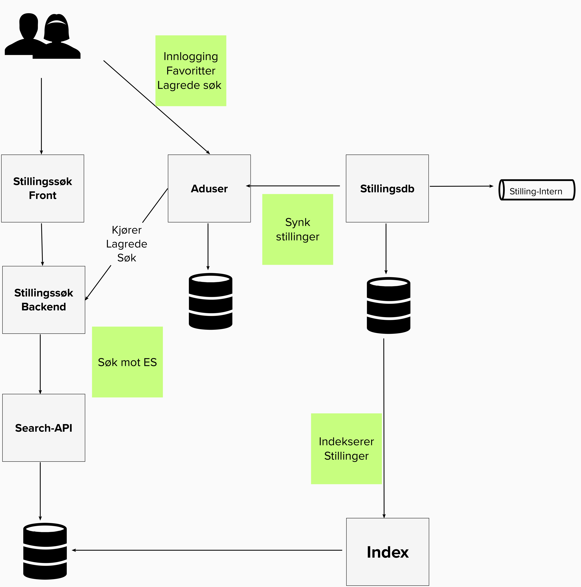

## Beskrivelse

Frontend-applikasjon for visning av stillinger på [arbeidsplassen.nav.no](https://arbeidsplassen.nav.no).

Applikasjonen har ansvar for søk og filtrering av stillinger, lagring av favorittstillinger og lagring av søk slik at
brukere kan få daglige oppdateringer pr. e-post.

Applikasjonen henter stillinger fra en dokumentdatabase (ElasticSearch) gjennom
[pam-search-api](https://github.com/navikt/pam-search-api). Lagrede søk og stillingsfavoritter, samt utsending av
e-poster skjer gjennom applikasjonen [pam-aduser](https://github.com/navikt/pam-aduser).
Navnet til innlogget bruker hentes fra [pam-cv-api](https://github.com/navikt/pam-cv-api).

## Avhengigheter

-   [pam-search-api](https://github.com/navikt/pam-search-api)
-   [pam-cv-api](https://github.com/navikt/pam-cv-api)
-   [pam-aduser](https://github.com/navikt/pam-aduser)

# Teknisk dokumentasjon

## Teknologier

-   React
-   Node

## Systemlandskap

Bildet viser en forenklet skisse av pam-stillingsok og nærmeste integrasjoner.



### Frontend

Appens frontend er skrevet i React. Den viser stillinger, favoritter og lagrede søk. Brukere kan søke etter
stillinger uten å logge inn, mens favoritter og lagrede søk krever innlogging.

### Backend

Appen har en backend for frontend skrevet i JavaScript (Node). Backenden står for en del logikk, blant annet
konvertering av søkekriterier i frontend til ElasticSearch for å kunne utføre spørringer mot pam-search-api.

### Stillingsdatabase (ElasticSearch) og pam-search-api

[navikt/pam-search-api](http://github.com/navikt/pam-search-api) har en dokumentdatabase med stillinger
(ElasticSearch) som pam-stillingsok henter stillinger fra via REST.

En index-tjeneste henter stillinger fra stillingsdatabasen og indekserer dem til ElasticSearch via  
REST.

### Lagrede favoritter, lagrede søk og pam-aduser

[navikt/pam-aduser](http://github.com/navikt/pam-aduser) har funksjonalitet for lagring av
favorittstillinger, lagrede søk og utsending av epost med lagrede søk. Appen har et REST API som pam-stillingsok sin frontend bruker for å
hente og editere favoritter og lagrede søk.

Favorittstillinger lagres i en Postgres-database i pam-aduser. Favorittene synces mot
stillingsdatabasen med masterdata for stillinger via REST for å fange opp endringer i stillingannonsers status, tittel
osv.

Lagrede søk fungerer ved at pam-stillingsok genererer en predefinert spørring som kan eksekveres mot pam-search-api.
Denne spørringen lagres i pam-aduser. Hver natt kjøres alle lagrede spørringer mot pam-stillingsok. Nye
stillinger sendes til brukere over epost med Microsoft Graph API.

# Komme i gang

## Før kjøring av applikasjonen

Før du starter må du installere alle npm pakkene, dette kan du gjøre ved å kjøre kommandoen:

```
$ npm install
```

### Hvordan få tilgang til @navikt/arbeidsplassen-react og @navikt/arbeidsplassen-css

Opprett fila `.npmrc` i hjemkatalogen din. F.eks. `~/.npmrc` Mer info: https://docs.npmjs.com/cli/v9/configuring-npm/npmrc

Legg til følgende i fila

```
@navikt:registry=https://npm.pkg.github.com
//npm.pkg.github.com/:_authToken=$TOKEN
```

Opprett et token med "read:packages" rettigheter. [https://github.com/settings/tokens](https://github.com/settings/tokens) Bytt ut \$TOKEN med tokenet du akkurat opprettet. Velg Authorize token under "Configure SSO" for å gi tokenet tilgang til @navikt.

Ikke sjekk inn `.npmrc` til GitHub.

Mer informasjon om autentisering: https://docs.github.com/en/packages/working-with-a-github-packages-registry/working-with-the-npm-registry#authenticating-with-a-personal-access-token

For å starte docker-containere for redis og mock-oauth2-server.

```
$ npm run start:dependencies
```

#### Go

Go er nødvendig for å bygge wonderwall binaries. Wonderwall brukes for lokal OIDC-flyt.

```
brew install go
```

## Kjøre applikasjonen lokalt

### Wonderwall

[Wonderwall](https://github.com/nais/wonderwall) brukes for å håndtere login med ID-porten.
Lokalt brukes også wonderwall, men her kjører vi mot en OIDC-provider i Docker.

Installer Wonderwall:

```
make install
```

Når applikasjonen er oppe, så kan du gå inn på [http://localhost:3000/stillinger](http://localhost:3000/stillinger)
Gå igjennom login-flyten ved å trykke login. Bruk testbruker `04010100653`

### Med dev script

Du kan enkelt kjøre applikasjonen ved hjelp av dev scriptet `./runDev.sh`
Scriptet starter opp wonderwall og setter følgende verdier som miljøvariabler:

```
PAMSEARCHAPI_URL=http://localhost:9000
PAMADUSER_URL=http://localhost:9017
PAM_STILLINGSOK_URL=http://localhost:8080/stillinger
PAM_VAR_SIDE_URL=http://localhost:8080/stillingsregistrering
PAM_JOBBTREFF_API_URL=http://localhost:8088/jobbtreff-promo
AMPLITUDE_TOKEN=(Dev Token)
```

Applikasjonen vil da forsøke å koble seg til pam-search-api gjennom `localhost:9000`.
Dersom du vil få inn teststillinger kan du koble deg direkte til et kjørende instans av pam-search-api i kubernetes. Dette gjør du med følgende kommando:

```
$ kubectl config use-context dev-gcp
$ kubectl -n teampam port-forward deployment/pam-search-api 9000:9000
```

Dersom du får får feilmelding ved kjøring av kommandoene over kan du prøve å logge inn i Gcloud med følgende kommando.

```
gcloud auth login
```

Om du får følgende output betyr det at port-forwarden funket og pam-search-api er tilgjengelig på port 9000.

```
Forwarding from 127.0.0.1:9000 -> 9000
Forwarding from [::1]:9000 -> 9000
```

## Bruk av innloggede tjenester

For å kunne bruke innloggede tjenester (dvs. favoritter og lagrede søk), må du først kjøre `pam-aduser`.
