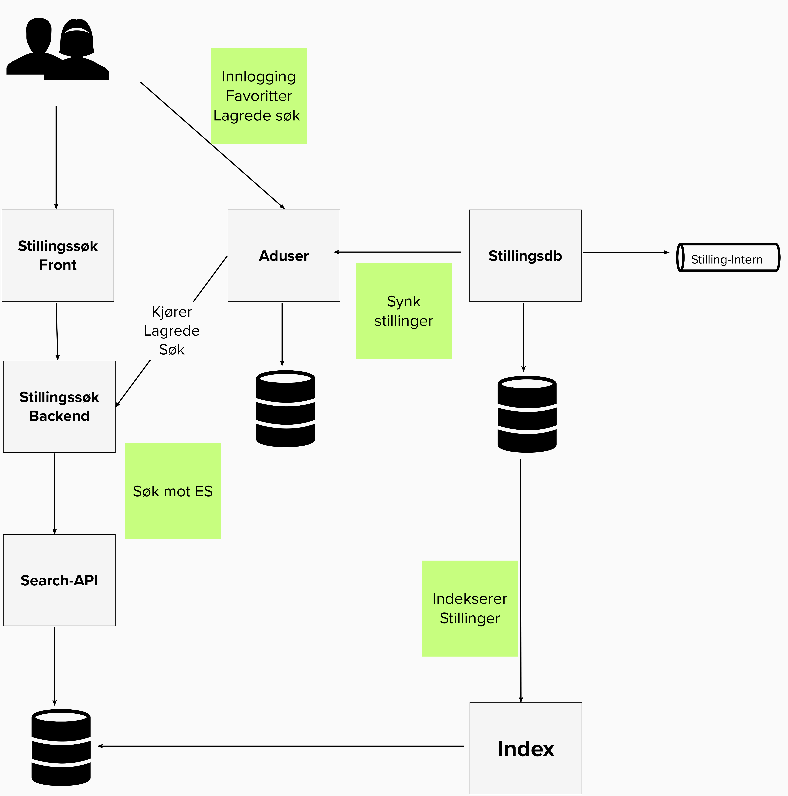

# pam-stillingsok

Frontend-applikasjon for stillingsøk på [arbeidsplassen.nav.no](https://arbeidsplassen.nav.no).
([dev: arbeidsplassen.intern.dev.nav.no/](https://arbeidsplassen.intern.dev.nav.no/))

Applikasjonen håndterer søk og filtrering av stillinger, lagring av favorittstillinger og lagring av søk slik at brukere kan få daglige oppdateringer per e-post. Brukere kan søke uten å logge inn, mens favoritter og lagrede søk krever innlogging.

## Innholdsfortegnelse

- [Teknologier](#teknologier)
- [Systemlandskap](#systemlandskap)
- [Komme i gang](#komme-i-gang)
    - [Forutsetninger](#forutsetninger)
    - [Tilgang til @navikt-pakker](#tilgang-til-navikt-pakker)
    - [Installere avhengigheter](#installere-avhengigheter)
    - [Starte applikasjonen](#starte-applikasjonen)
- [Lokal utvikling med Docker](#lokal-utvikling-med-docker)
    - [Tilgang til Docker-images](#tilgang-til-docker-images)
    - [Starte avhengigheter](#starte-avhengigheter)
- [Mappestruktur](#mappestruktur)
- [Tilgjengelige kommandoer](#tilgjengelige-kommandoer)
- [Testing](#testing)
- [Logging](#logging)
- [Deployment](#deployment)
- [Artikler og SEO](#artikler-og-seo)
- [Teknisk dokumentasjon](#teknisk-dokumentasjon)
- [AI-assistanse (GitHub Copilot)](#ai-assistanse-github-copilot)

---

## Teknologier

| Teknologi                                          | Versjon             |
| -------------------------------------------------- | ------------------- |
| [Next.js](https://nextjs.org/)                     | 16.x                |
| [React](https://react.dev/)                        | 19.x                |
| [TypeScript](https://www.typescriptlang.org/)      | 5.x                 |
| [Aksel (NAV Design System)](https://aksel.nav.no/) | 8.x                 |
| [Vitest](https://vitest.dev/)                      | 3.x                 |
| [pnpm](https://pnpm.io/)                           | 10.24.0 (låst)      |
| Node.js                                            | 24.x (via `.nvmrc`) |

---

## Systemlandskap

Bildet viser en forenklet skisse av `pam-stillingsok` og nærmeste integrasjoner.



| Tjeneste                                                                         | Rolle                                            |
| -------------------------------------------------------------------------------- | ------------------------------------------------ |
| [arbeidsplassen-search-api](https://github.com/navikt/arbeidsplassen-search-api) | Søk i stillinger via OpenSearch                  |
| [pam-aduser](https://github.com/navikt/pam-aduser)                               | Favoritter, lagrede søk og e-postutsending       |
| Wonderwall                                                                       | Autentiseringsproxy (OpenID Connect / ID-porten) |
| Redis / Valkey                                                                   | Server-side cache for Next.js                    |

---

## Komme i gang

### Forutsetninger

- **Node.js** 24.x — bruk [nvm](https://github.com/nvm-sh/nvm) og `.nvmrc` i roten av repoet:
    ```shell
    nvm install
    nvm use
    ```
- **pnpm** 10.24.0 — prosjektet bruker pnpm (ikke npm/yarn). Installer via [Corepack](https://nodejs.org/api/corepack.html):
    ```shell
    npm install -g corepack@latest
    corepack enable pnpm
    ```
    Etter kloning, sjekk at riktig versjon brukes:
    ```shell
    pnpm -v   # skal være 10.24.0
    ```
    Stemmer ikke versjonen, kjør:
    ```shell
    corepack use pnpm@10.24.0
    ```
- **Docker** — kreves for å kjøre backend-tjenester lokalt
- **gcloud CLI** — kreves for tilgang til Docker-images fra Google Artifact Registry

> [!IMPORTANT]
> Bruk alltid `pnpm` for avhengigheter. Ikke bruk `npm install` eller `yarn`.
>
> ```shell
> pnpm add <pakke>
> pnpm add -D <pakke>   # devDependency
> ```

### Tilgang til @navikt-pakker

Prosjektet bruker pakker fra GitHub Package Registry (`@navikt/*`). Du må sette opp autentisering én gang per maskin.

1. Opprett filen `~/.npmrc` (hjemkatalogen din):
    ```
    @navikt:registry=https://npm.pkg.github.com
    //npm.pkg.github.com/:_authToken=TOKEN_HER
    ```
2. Opprett et GitHub Personal Access Token med `read:packages`-rettigheter:
   [github.com/settings/tokens](https://github.com/settings/tokens)
3. Bytt ut `TOKEN_HER` med tokenet du opprettet.
4. Velg **"Authorize token"** under **"Configure SSO"** for å gi tilgang til `@navikt`.

> [!CAUTION]
> Sjekk **aldri** inn `.npmrc` til GitHub. Filen inneholder et personlig access token.

Mer info: [GitHub-dokumentasjon for npm-registry](https://docs.github.com/en/packages/working-with-a-github-packages-registry/working-with-the-npm-registry#authenticating-with-a-personal-access-token)

### Installere avhengigheter

```shell
pnpm install
```

### Starte applikasjonen

```shell
pnpm dev
```

Appen kjører på port **3003**, men du bør bruke port **3000** (via Wonderwall-proxyen) for å teste innlogging og innloggede tjenester:

👉 [http://localhost:3000/stillinger](http://localhost:3000/stillinger)

> [!TIP]
> Logg inn med testbruker `04010100653` via innloggings-flyten på forsiden.

---

## Lokal utvikling med Docker

For å kjøre backend-tjenester lokalt trenger du [Docker](https://docs.docker.com/engine/install/) og [gcloud CLI](https://cloud.google.com/sdk/docs/install).

Klone fellestjenester-repoet ved siden av `pam-stillingsok`:

```shell
git clone git@github.com:navikt/pam-docker-compose-shared.git ../pam-docker-compose-shared
```

### Tilgang til Docker-images

```shell
# Logg inn i gcloud
gcloud auth login

# Legg til Docker-registeret
gcloud auth configure-docker europe-north1-docker.pkg.dev

# Hent access token og logg inn i Docker
gcloud auth print-access-token \
  | docker login \
  -u oauth2accesstoken \
  --password-stdin https://europe-north1-docker.pkg.dev
```

### Starte avhengigheter

Velg oppsettet som passer det du skal jobbe med:

| Kommando                                             | Beskrivelse                                                                                                          |
| ---------------------------------------------------- | -------------------------------------------------------------------------------------------------------------------- |
| `pnpm run start:dependencies`                        | Starter Redis, mock-OAuth2-server, Wonderwall og pam-aduser. Henter stillinger fra dev/prod.                         |
| `pnpm run start:dependencies-with-local-search`      | Starter i tillegg lokal OpenSearch og Kafka. Brukes for å registrere stillinger lokalt eller teste superrask søknad. |
| `pnpm run start:dependencies-with-update-containers` | Som over, men oppdaterer Docker-images automatisk før oppstart.                                                      |

> [!TIP]
> Får du feil med `pnpm run start:dependencies` kan det hende `pam-aduser`-imaget i `docker-compose.yml` er utdatert.
> List de 10 siste versjonene:
>
> ```shell
> gcloud container images list-tags europe-north1-docker.pkg.dev/nais-management-233d/teampam/pam-aduser \
>   --sort-by=~tags --filter="tags:* AND NOT tags:sha256*" \
>   --limit=10 --format="value(tags)" | cut -d "," -f2
> ```

> [!TIP]
> Oppdater containere automatisk med:
>
> ```shell
> ./update-containers.sh
> ```

---

## Mappestruktur

```
pam-stillingsok/
├── src/
│   ├── app/                      # Next.js App Router
│   │   ├── (artikler)/           # Artikler (SEO, sitemap, nettstedkart)
│   │   ├── (forside)/            # Forside
│   │   ├── _common/              # Delte layouts, komponenter og utilities
│   │   ├── _experiments/         # Eksperimentelle funksjoner
│   │   ├── api/                  # API-ruter (Next.js route handlers)
│   │   ├── min-side/             # «Min side» (innlogget bruker)
│   │   ├── muligheter/           # Muligheter-seksjonen
│   │   ├── sommerjobb/           # Sommerjobb-stillinger
│   │   ├── stillinger/           # Stillingsøket (hovedfunksjonalitet)
│   │   ├── superrask-soknad/     # Superrask søknad
│   │   ├── tilbakemeldinger/     # Tilbakemeldinger
│   │   └── ung/                  # Ung-seksjonen
│   ├── features/                 # Feature-spesifikk forretningslogikk
│   ├── hooks/                    # Delte React-hooks
│   ├── server/                   # Server-side utilities
│   │   ├── schemas/              # Zod-valideringsschemaer
│   │   └── utils/                # Servertjenester og hjelpefunksjoner
│   └── types/                    # Globale TypeScript-typer
├── .github/
│   ├── workflows/                # CI/CD (GitHub Actions)
│   ├── agents/                   # Copilot-agenter
│   ├── instructions/             # Copilot-instruksjoner
│   ├── prompts/                  # Gjenbrukbare Copilot-prompts
│   ├── skills/                   # Copilot-skills
│   └── copilot-instructions.md   # Prosjektregler for AI-assistanse
├── public/                       # Statiske filer
├── next.config.mjs               # Next.js-konfigurasjon
├── vitest.config.ts              # Vitest-konfigurasjon
└── docker-compose.yml            # Lokal Docker-oppsett
```

---

## Tilgjengelige kommandoer

| Kommando                  | Beskrivelse                                 |
| ------------------------- | ------------------------------------------- |
| `pnpm dev`                | Start utviklingsserver (port 3003, webpack) |
| `pnpm dev:turbo`          | Start med Turbopack (eksperimentelt)        |
| `pnpm build`              | Produksjonsbygg med Sentry sourcemaps       |
| `pnpm build:no-sourcemap` | Produksjonsbygg uten sourcemaps             |
| `pnpm start`              | Start produksjonsserver                     |
| `pnpm test`               | Kjør tester én gang                         |
| `pnpm test:watch`         | Kjør tester i watch-modus                   |
| `pnpm lint`               | Kjør ESLint                                 |
| `pnpm lint:fix`           | Auto-fiks ESLint-feil                       |
| `pnpm prettier`           | Sjekk formatering                           |
| `pnpm prettier:fix`       | Auto-fiks formatering                       |
| `pnpm compileTS`          | Typesjekk uten å bygge (`tsc --noEmit`)     |

---

## Testing

Prosjektet bruker [Vitest](https://vitest.dev/) med [Testing Library](https://testing-library.com/).

- Testfiler plasseres **ved siden av kildefilen** de tester
- Filnavn: `*.test.ts` eller `*.test.tsx`
- Miljø: jsdom (browser-simulering)
- Alias `@` peker på `./src`

```shell
# Kjør alle tester
pnpm test

# Watch-modus under utvikling
pnpm test:watch

# Typesjekk
pnpm compileTS
```

---

## Logging

Vi bruker [`@navikt/next-logger`](https://github.com/navikt/pino-logger) (Pino/JSON) for strukturert logging. Logger skrives som én JSON-linje per hendelse i produksjon, noe som gjør det enkelt å søke og filtrere i Grafana/Loki.

### Bruk

```ts
import { appLogger } from "./appLogger";

appLogger.info("Starter opp");

// Exception — bruk errorWithCause
try {
    // ...
} catch (caught) {
    appLogger.errorWithCause("Kunne ikke veksle inn token", caught);
}

// Error med metadata
appLogger.error("Det oppstod feil ved henting av stillinger", {
    component: "elasticsearch",
    errorCount: errors.length,
    esErrors: errors,
});

// HTTP-feil — legg kontekst, ikke hele Response-objektet
appLogger.httpError("GET user feilet", {
    method: "GET",
    url: res.url,
    status: res.status,
    statusText: text,
});
```

### Frontend-logger

Klientlogger sendes via API-ruten `app/api/logger/route.ts` og logges server-side:

```ts
export { POST } from "@navikt/next-logger/app-dir";
```

### Team-logs (valgfritt)

Vi bruker ikke team-logs per i dag, men @navikt/next-logger støtter det dersom behovet oppstår (f.eks. for å rute utvalgte logger til egne loggstrømmer).

### Debug-logging i produksjon

Debug-logger er skrudd av som standard i produksjon. For å aktivere midlertidig:

```shell
kubectl --namespace=teampam --context=dev-gcp edit deployment pam-stillingsok
# Sett LOG_LEVEL=debug, lagre og restart
# Husk å sette LOG_LEVEL=info igjen etterpå
```

---

## Deployment

| Branch-mønster                      | Effekt                                         |
| ----------------------------------- | ---------------------------------------------- |
| `feature/**`                        | Automatisk deploy til **dev**                  |
| `master`                            | Bygger og oppretter draft release for **prod** |
| Commit med `deploy:dev` i meldingen | Deploy til dev (hopper over draft release)     |

Se [`.github/workflows/deploy-dev.yml`](.github/workflows/deploy-dev.yml) og [pam-deploy](https://github.com/navikt/pam-deploy) for detaljer.

### Release til prod

For å deploye en release til prod går man til [releases](https://github.com/navikt/pam-stillingsok/releases) → edit
release → Update release

---

## Artikler og SEO

Artikler under `src/app/(artikler)` bruker et felles `pageInfo`-oppsett for SEO, sitemap og nettstedkart.

[Les mer i `src/app/(artikler)/README.md`](src/app/%28artikler%29/README.md)

---

## Teknisk dokumentasjon

### Stillingsdatabase og arbeidsplassen-search-api

[navikt/arbeidsplassen-search-api](https://github.com/navikt/arbeidsplassen-search-api) eksponerer et REST-API mot en OpenSearch-indeks med stillinger. `pam-stillingsok` oversetter søkekriterier fra brukergrensesnittet til spørringer og sender dem til dette APIet.

### Favoritter, lagrede søk og pam-aduser

[navikt/pam-aduser](https://github.com/navikt/pam-aduser) håndterer:

- **Favorittstillinger** — lagres i Postgres og synkroniseres mot OpenSearch for å fange opp endringer i annonser (status, tittel, osv.)
- **Lagrede søk** — `pam-stillingsok` genererer en forhåndsdefinert spørring som lagres i `pam-aduser`. Hver natt kjøres alle lagrede spørringer, og nye stillinger sendes til brukerne på e-post via Microsoft Graph API.
- **Brukernavn** — innlogget brukers navn hentes fra `pam-aduser`

---

## AI-assistanse (GitHub Copilot)

Prosjektet har tilpassede instruksjoner, agenter, prompts og skills for GitHub Copilot:

| Ressurs                                                      | Beskrivelse                                         |
| ------------------------------------------------------------ | --------------------------------------------------- |
| [`copilot-instructions.md`](.github/copilot-instructions.md) | Prosjektregler (TypeScript, Next.js, Vitest, Aksel) |
| [`.github/agents/`](.github/agents/)                         | Spesialiserte agenter (accessibility, aksel)        |
| [`.github/instructions/`](.github/instructions/)             | Instruksjonsfiler for tilgjengelighet og Aksel      |
| [`.github/prompts/`](.github/prompts/)                       | Gjenbrukbare prompts (API-ruter, komponenter)       |
| [`.github/skills/`](.github/skills/)                         | Skills for spacing og design review                 |
