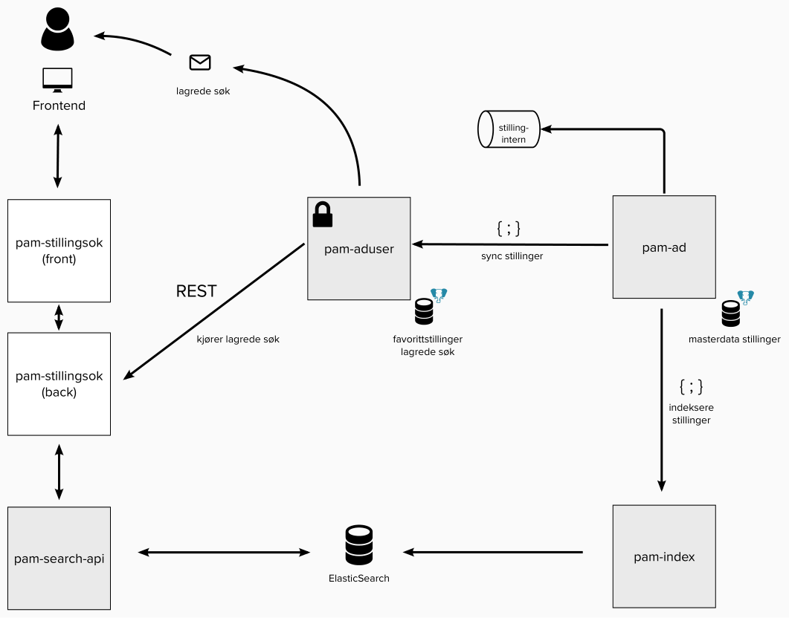

## Beskrivelse

Frontend-applikasjon for visning av stillinger på [arbeidsplassen.nav.no](https://arbeidsplassen.nav.no).

Applikasjonen har ansvar for søk og filtrering av stillinger, lagring av favorittstillinger og lagring av søk slik at
brukere kan få daglige oppdateringer pr. e-post.

Applikasjonen henter stillinger fra en dokumentdatabase (OpenSearch) gjennom
[arbeidsplassen-search-api](https://github.com/navikt/arbeidsplassen-search-api). Lagrede søk og stillingsfavoritter, samt utsending av
e-poster skjer gjennom applikasjonen [pam-aduser](https://github.com/navikt/pam-aduser).
Navnet til innlogget bruker hentes fra [pam-aduser](https://github.com/navikt/pam-aduser).

## Før kjøring av applikasjonen lokalt

### Hvordan få tilgang til @navikt/arbeidsplassen-react og @navikt/arbeidsplassen-css

Opprett fila `.npmrc` i hjemkatalogen din. F.eks. `~/.npmrc` Mer info: https://docs.npmjs.com/cli/v9/configuring-npm/npmrc

Legg til følgende i fila

```
@navikt:registry=https://npm.pkg.github.com
//npm.pkg.github.com/:_authToken=$TOKEN
```

Opprett et token med "read:packages" rettigheter. [https://github.com/settings/tokens](https://github.com/settings/tokens) Bytt ut \$TOKEN med tokenet du akkurat opprettet. Velg Authorize token under "Configure SSO" for å gi tokenet tilgang til @navikt.

> [!CAUTION]
> Ikke sjekk inn `.npmrc` til GitHub.

Mer informasjon om autentisering: https://docs.github.com/en/packages/working-with-a-github-packages-registry/working-with-the-npm-registry#authenticating-with-a-personal-access-token

### Wonderwall

> [!TIP]
> Gå igjennom login-flyten ved å trykke login. Bruk testbruker `04010100653`

### Docker Compose

For å kjøre backend så trenger du å installere [Docker](https://docs.docker.com/engine/install/),
og for å få tilgang til images må du ha [gcloud cli](https://cloud.google.com/sdk/docs/install) installert.

For å kjøre Docker Compose lokalt, trenger du repot med fellestjenester.
Hvis du ikke har det, klone det og legg i samma mappe som `pam-stillingsok`:

```shell
git clone git@github.com:navikt/pam-docker-compose-shared.git ../pam-docker-compose-shared
```

#### Autentiser Docker repo

Autentiser `gcloud`

```shell
gcloud auth login
```

Legg in Docker repo i credentials helper

```shell
gcloud auth configure-docker europe-north1-docker.pkg.dev
```

Hent token og logg in i Docker

```shell
gcloud auth print-access-token \
  | docker login \
  -u oauth2accesstoken \
  --password-stdin https://europe-north1-docker.pkg.dev
```

Du kan nå starte Docker Compose for fellestjenestene og lokalt, med kommandoen som passer til det du trenger

```shell
$ npm run start:dependencies
.. eller ...
$ npm run start:dependencies-with-local-search
.. eller ...
$ npm run start:dependencies-with-update-containers
```

> [!TIP]
> Får du feil når du kjører `npm run start:dependencies` kan det hende du må oppdatere `pam-aduser` imaget i `docker-compose.yml`
> For å liste opp de siste 10 versjonene (docker tagsen)
>
> ```shell
> gcloud container images list-tags europe-north1-docker.pkg.dev/nais-management-233d/teampam/pam-aduser --sort-by=~tags --filter="tags:* AND NOT tags:sha256*" --limit=10 --format="value(tags)" | cut -d "," -f2
> ```

Skriptet sørger for å starte felles tjenester og lage databaser som trengs.

> [!TIP]
> Du kan også automatisk oppdatere avhengigheter med denne kommandoen
>
> ```shell
> ./update-containers.sh
> ```

## Start applikasjonen

```shell
$ npm install
$ npm run dev
```

Du kan deretter velge å kjøre applikasjonen med teststillinger fra dev- eller prod-miljøet, eller kjøre en lokal instans av opensearch.
Sistnevnte krever at du registrerer stillinger i stillingsregistrering lokalt, og er nødvendig for å enkelt kunne teste superrask søknad lokalt.

Gå til instruksjonene som passer det du vil starte opp.

Når applikasjonen er oppe, så kan du gå inn på [http://localhost:3000/stillinger](http://localhost:3000/stillinger)
(selve applikasjonen kjører på port 3003, men for å kunne benytte autentisering bruker du port 3000).

### Med teststillinger fra dev- og prod-miljøet

For å starte docker-containere for redis, mock-oauth2-server og wonderwall.

```shell
$ npm run start:dependencies
```

### Med teststillinger fra lokal opensearch

Bruk dette oppsettet hvis du ønsker å registrere stillinger lokalt og/eller teste superrask søknad lokalt.
Dette krever at du også kjører upp `pam-stillingsregistrering` lokalt, med tilhørende Docker-tjenester som følger med lokalt søk.

For å starte alle containrer, kjør

```shell
$ npm run start:dependencies-with-local-search
```

## Tests

For å kjøre tester så kan du bruke følgende kommando:

```bash
npx playwright test
```

Tester vil kjøre i github hvis en av følgende er sant:

1. Push til master/main
2. Pull request blir laget
3. Commits som innholder `run:tests`

## Deployment

Lyst til å teste i dev-miljøet? `feature/**` branches pushes automatisk til dev eller så kan man alternativt legge til `deploy:dev` i commit meldingen for å trigge deployment til dev. Dette vil hoppe over opprettelsen av draft release, se deploy-dev.yml fila eller [pam-deploy](https://github.com/navikt/pam-deploy/blob/master/.github/workflows/deploy-dev.yml) for mer.

## Bruk av innloggede tjenester

For å kunne bruke innloggede tjenester (dvs. favoritter og lagrede søk), må du først kjøre `pam-aduser`.

> [!TIP]
> Tjenesten `pam-aduser` startes automatisk av `npm run start:dependencies`

## Teknisk dokumentasjon

### Avhengigheter

- [arbeidsplassen-search-api](https://github.com/navikt/arbeidsplassen-search-api)
- [pam-aduser](https://github.com/navikt/pam-aduser)

### Teknologier

Stillingsøket kjører i Next.js rammeverket. Den viser stillinger, favoritter og lagrede søk. Brukere kan søke etter
stillinger uten å logge inn, mens favoritter og lagrede søk krever innlogging.

Server-side står for en del logikk, blant annet
konvertering av søkekriterier i frontend til ElasticSearch for å kunne utføre spørringer mot arbeidsplassen-search-api.

### Systemlandskap

Bildet viser en forenklet skisse av `pam-stillingsok` og nærmeste integrasjoner.



### Stillingsdatabase (ElasticSearch) og arbeidsplassen-search-api

[navikt/arbeidsplassen-search-api](http://github.com/navikt/arbeidsplassen-search-api) har en dokumentdatabase med stillinger
(ElasticSearch) som `pam-stillingsok` henter stillinger fra via REST.

En index-tjeneste henter stillinger fra stillingsdatabasen og indekserer dem til ElasticSearch via  
REST.

### Lagrede favoritter, lagrede søk og pam-aduser

[navikt/pam-aduser](http://github.com/navikt/pam-aduser) har funksjonalitet for lagring av
favorittstillinger, lagrede søk og utsending av epost med lagrede søk. Appen har et REST API som `pam-stillingsok` bruker for å
hente og editere favoritter og lagrede søk.

Favorittstillinger lagres i en Postgres-database i `pam-aduser`. Favorittene synces mot
stillingsdatabasen med masterdata for stillinger via REST for å fange opp endringer i stillingannonsers status, tittel
osv.

Lagrede søk fungerer ved at `pam-stillingsok` genererer en predefinert spørring som kan eksekveres mot `arbeidsplassen-search-api`.
Denne spørringen lagres i `pam-aduser`. Hver natt kjøres alle lagrede spørringer mot `pam-stillingsok`. Nye
stillinger sendes til brukere over epost med Microsoft Graph API.
,
